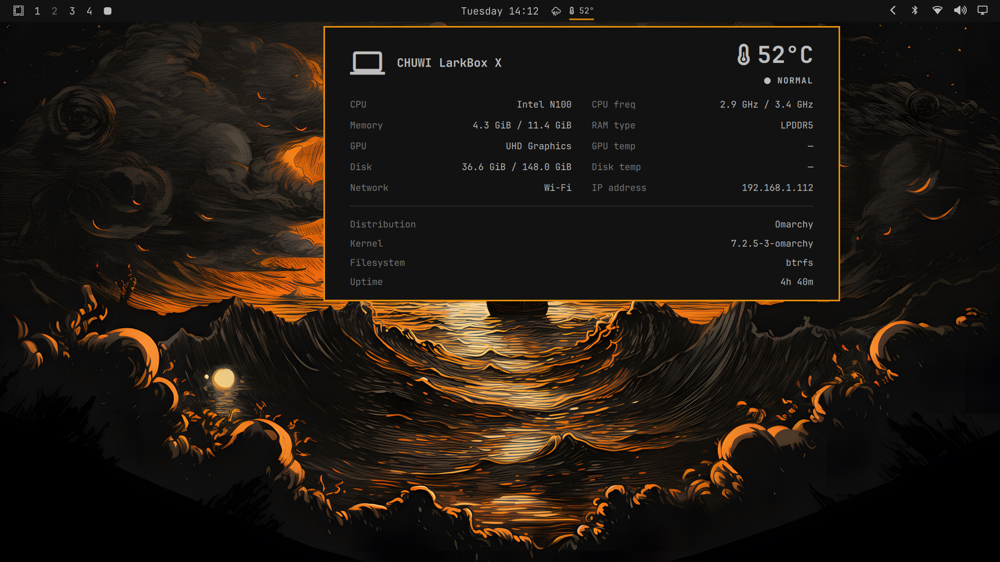

# Quick System Info

Quick System Info is an Omarchy bar widget that adds a compact temperature pill to the bar and a clean popup panel for hardware and system status.



## Features

- Bar pill with current CPU package temperature
- Popup panel with:
  - device brand and model in the header
  - CPU model and current/max frequency
  - memory usage and RAM type
  - disk usage
  - GPU name and temperature when available
  - network label and IP address
  - distribution, kernel, filesystem, and uptime
  - quick copy actions for static hardware/system fields
  - click the top-left header area to copy all shown information
- Left click opens the panel
- Middle click refreshes data
- Right click opens `btop`
- Performance-focused collector with cached static and network data

## Install

Install from a git repository with:

```bash
omarchy plugin add https://github.com/sisocobacho/jca.quick-system-info --enable --yes
```

Or install by hand:

```bash
git clone https://github.com/sisocobacho/jca.quick-system-info ~/.config/omarchy/plugins/jca.quick-system-info
omarchy-shell shell rescanPlugins
omarchy plugin enable jca.quick-system-info
```

## Update

```bash
omarchy plugin update jca.quick-system-info --yes
```

### Upgrading from older versions

If you already have the plugin installed, the command above is the normal way to upgrade.

If the update completes but the interface still looks unchanged, force a shell restart and reopen the widget:

```bash
omarchy restart shell
```

If you have local edits in `~/.config/omarchy/plugins/jca.quick-system-info`, `omarchy plugin update` may refuse to update until those changes are committed, stashed, or removed.

## Remove

```bash
omarchy plugin remove jca.quick-system-info
```

## Controls

- Left click: open panel
- Middle click: refresh
- Right click: open `btop`
- Click selected fields in the popup to copy their value
- Hover and click the top-left header area to copy all shown information

## Requirements

The plugin expects these tools to be available:

- `python3`
- `lm_sensors` (`sensors`)
- `iproute2` (`ip`)
- `NetworkManager` (`nmcli`) for Wi-Fi SSID detection
- `pciutils` (`lspci`) for GPU name detection
- `inxi` for RAM type detection
- `btop` for right-click launch
- `wl-copy` for popup copy actions

The widget degrades gracefully if some data sources are missing.

## Notes

- Static hardware information is cached for 24 hours.
- Network information is cached for 15 seconds.
- GPU and disk temperatures depend on available sensors on the host machine.
- RAM type depends on `inxi` and the system firmware exposing memory information.
- The plugin uses only local system commands and local files. It does not make network requests.
- Review the code before enabling, as Omarchy plugins run as local unsandboxed code inside `omarchy-shell`.

## Development

Test locally from the plugin directory:

```bash
python3 -m py_compile collect.py
python3 collect.py
omarchy-shell shell rescanPlugins
```

## License

MIT
